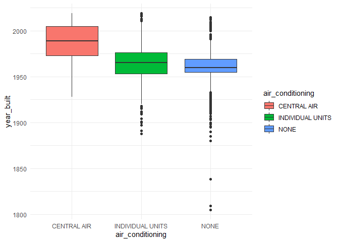
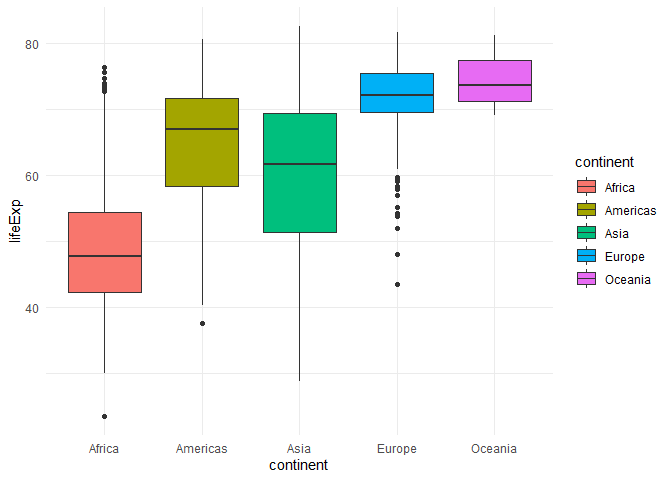

Assignment B-1 Making a function
================
Fardowsa Yusuf
31/10/2021

To start, I will subset and create the version of data I used in my STAT
545A mini-data analysis. This data will be used to test the function.

``` r
# I subsetted the private apartments
# I selected the apartment id, the explanatory variable: year_built and the 4 outcome variables: air_conditioning, balconies, fire_alarm and no_of_storeys
# I converted the air_conditioning, balconies and fire_alarm variable to a factor 
# Created a categorized variable for year_built and number of no_of_storeys
# Arranged rows by descending year (most recent -> earliest)

apt_buildings_subset <- apt_buildings %>%
                          filter(property_type == "PRIVATE") %>%
                          select(id, year_built, air_conditioning, no_of_storeys, fire_alarm, balconies) %>%
                          mutate(air_conditioning = as.factor(air_conditioning),
                          balconies = as.factor(balconies),
                          fire_alarm = as.factor(fire_alarm),
                          no_of_storeys_cat = case_when(no_of_storeys < 5 ~ " 0-4",
                                                        no_of_storeys < 10 ~ " 5-9",
                                                        no_of_storeys < 15 ~ "10-14",
                                                        no_of_storeys < 20 ~ "15-19",
                                                        no_of_storeys < 25 ~ "20-24",
                                                        no_of_storeys < 30 ~ "25-29",
                                                        no_of_storeys < 35 ~ "30-34",
                                                        no_of_storeys < 40 ~ "35-39",
                                                        no_of_storeys < 45 ~ "40-44",
                                                        no_of_storeys < 50 ~ "45-49",
                                                        TRUE ~ "50-54"),
                          year_built_cat = case_when(year_built < 1850 ~ "1805-1849",
                                                     year_built < 1900 ~ "1850-1899",
                                                     year_built < 1950 ~ "1900-1949",
                                                     year_built < 2000 ~ "1950-1999",
                                                     year_built < 2020 ~ "2000-2019")) %>%
                          arrange(desc(year_built))
```

## Exercise 1 and 2: Make a Function and Document the Function

-   First, I will **create a function** that produces the side-by-side
    box plots for a numeric variable across levels of a categorical
    variable. Side-by-side box plots can be repeated to explore various
    relationships in the data.
-   Second, I will **document** this function above it using roxygen2
    tags.

``` r
#' @title Side-By-Side Box plots Function
#'
#' @description This function produces box plots for a numeric column 
#' across levels of a text/factor column, from a tibble or data frame.
#' 
#' @param data The tibble or data frame which contains the numeric 
#' and text/factor columns. The reason why this parameter 
#' was named 'data' was because it represents the dataset.
#' @param cat The text or factor column name. The reason why this parameter 
#' was named 'cat' was because it represents a categorical variable.
#' @param num The numeric column name. The reason why this parameter 
#' was named 'num' was because it represents a numeric variable.
#' 
#' @return Box plots of the numeric column for each level of the 
#' text/factor column. Throws an error if `cat` and `num` are not the proper class.

boxplots = function(data, cat, num) {
  if(!is.factor(pull(data, {{cat}})) && !is.character(pull(data, {{cat}}))) {
    stop('I am sorry, `cat` column must be of class character or factor.',
        'You have provided an object of class:', class(pull(data, {{cat}}))[1])
  }
    if(!is.numeric(pull(data,{{num}}))) {
      stop('I am sorry, `num` column must be numeric class.',
          'You have provided an object of class:', class(pull(data, {{num}}))[1])
    }
      data %>%
        drop_na({{cat}}, {{num}}) %>%
        ggplot(aes(x = {{cat}}, y = {{num}}, fill = {{cat}})) +
        geom_boxplot() +
        theme_minimal()
      }
```

## Exercise 3: Demonstrate usage of function with a few examples

-   First, I will see if the boxplots function works when visualizing
    the relationship between the presence of balconies (categorical
    variable of class factor) and the year the apartment was built
    (numeric variable), amongst private apartments.

``` r
# plot box plots for year_built  across levels of balconies, among private apartments
boxplots(apt_buildings_subset, balconies, year_built)
```

<!-- -->

-   Second, I will see if the boxplots function works when visualizing
    the relationship between the presence of balconies (categorical
    variable of class character) and the year the apartment was built
    (numeric variable), amongst all apartments.

``` r
# plot box plots for year_built  across levels of air_conditioning, among all apartments
boxplots(apt_buildings, air_conditioning, year_built)
```

<!-- -->

-   Third, I will see if the boxplots function works using another
    dataset. I will visualize the relationship between continent
    (categorical variable of class factor) and life expectancy (numeric
    variable).

``` r
# plot box plots for lifExp  across levels of continent
boxplots(gapminder, continent, lifeExp)
```

<!-- -->

## Exercise 4: Test the Function

Now, I will write formal tests for the boxplots function. I will test
for the following:

-   Whether the function produces an object of class ggplot
-   Whether the function throws an error if a numeric column is inputted
    to the ‘cat’ argument
-   Whether the function throws an error if a column name that is not
    present in the dataset is inputted to the ‘num’ argument

``` r
# Test whether function produces object of class ggplot, throws error for numeric cat argument 
# and throws error if column that does not exist is inputted to num argument

test_that("Testing boxplots function", {
  expect_is(boxplots(apt_buildings_subset, air_conditioning, year_built), "ggplot")
  
  expect_error(boxplots(apt_buildings_subset, year_built, year_built, 
                        "I am sorry, `cat` column must be of class character or factor.You have provided an object of class:numeric"))
  
  expect_error(boxplots(apt_buildings_subset, air_conditioning, x))
  
})
```

    ## Test passed
