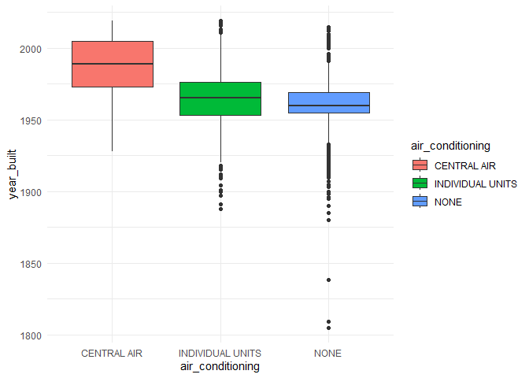
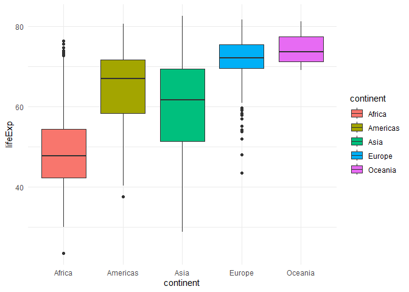

# functionsflayusuf

The goal of functionsflayusuf is to produce box plots for a numeric
column across levels of a text/factor column, from a tibble or data
frame.

## Installation

**functionsflayusuf** is not yet on CRAN. But, you can download it from
this repository using the following R command.

``` r
devtools::install_github("stat545ubc-2021/functionsflayusuf")
```

## Example

These are a few examples of the use of the function boxplots in the
package functionsflayusuf:

``` r
library(functionsflayusuf)
library(datateachr)

boxplots(datateachr::apt_buildings, air_conditioning, year_built)
```



``` r
library(gapminder)

boxplots(gapminder::gapminder, continent, lifeExp)
```


